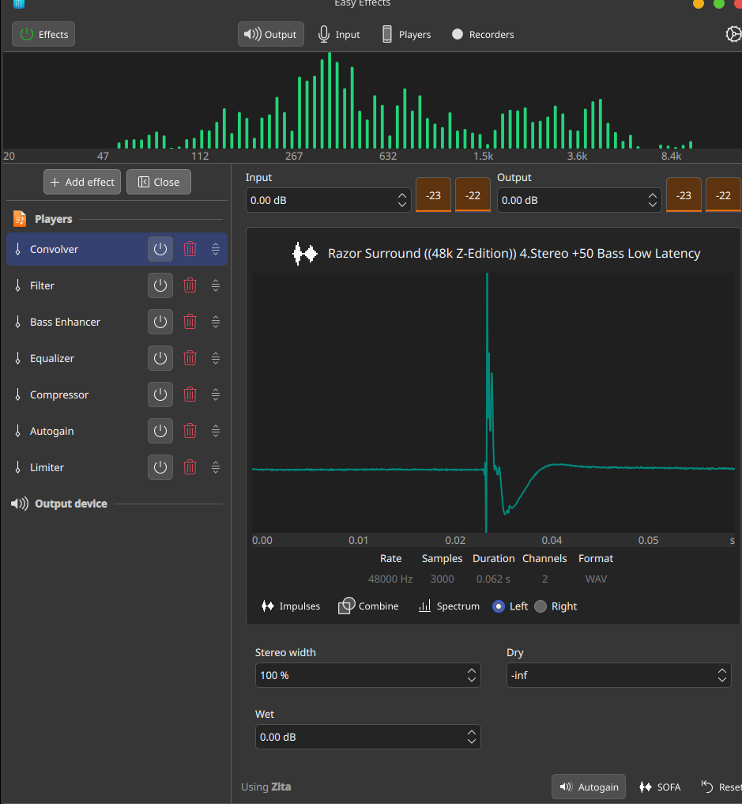

# HP 14s-fq2003au EasyEffects Audio Preset 🎧🔊

[](https://opensource.org/licenses/MIT)
[](https://github.com/wwmm/easyeffects)
[](https://pipewire.org/)
[]()

A finely-tuned, high-fidelity **EasyEffects** audio preset with **Convolution (IRS)** specifically crafted for the **HP 14s Laptop series** (specifically **HP 14s-fq2003au** with AMD Ryzen 5 5625U and Realtek ALC236 audio).

---

## 🧐 The Problem with Default Linux Audio on HP 14s

On Windows, HP laptops rely on proprietary DTS / Realtek APO software to compensate for small laptop speakers. When switching to Linux (Fedora, Arch, Ubuntu, etc.), that processing is absent, resulting in:
- Thin, tinny, and hollow sound.
- Violent chassis vibration and buzzing (*plastic rattle*) when low bass notes are played.
- Severe distortion and harsh digital clipping when users try to manually boost the equalizer by +8 dB to +9 dB without proper digital headroom.

---

## ✨ The Best Setting: Convolver (Razor Surround 48k Z-Edition)

This preset utilizes a calibrated **Convolution Impulse Response (FIR filter)** to completely transform the laptop's soundstage:



### 🎛️ Why This Convolver Profile is the Best:
1. **Punchy, Clean Bass (+50 Bass Low Latency):**
   - Delivers deep, resonant bass without muddying mids or causing physical speaker bottom-out and chassis rattle.
2. **True Stereo Soundstage (100% Width):**
   - Expands the perceived soundstage far beyond the physical boundaries of the laptop speakers, creating an immersive, room-filling experience.
3. **Ultra-Low Latency & High Fidelity:**
   - 48,000 Hz native sampling rate, 3,000 samples, 0.062 s duration. Zero noticeable audio lag in gaming, videos, and music.
4. **Zero Phase Distortion:**
   - Unlike multi-band parametric EQs which can introduce phase shifting at steep boost curves, convolution FIR filters process all frequencies with optimal phase response.
5. **Standby Modules Available:**
   - The preset also bundles standby EQ, Filter, Compressor, and Limiter modules ready to be toggled if custom fine-tuning is desired.

---

## 🚀 Quick Installation

### Option 1: One-Line Automated Installer (Recommended)

Open your terminal and run:

```bash
git clone https://github.com/candraalief/hp-14s-fq2003au-easyeffects.git
cd hp-14s-fq2003au-easyeffects
./install.sh
```

The script will automatically:
1. Copy the preset `HP-14s-FQ2003AU.json` to `~/.local/share/easyeffects/output/`.
2. Copy the required kernel file `Razor Surround ((48k Z-Edition)) 4.Stereo +50 Bass Low Latency.irs` to `~/.local/share/easyeffects/irs/`.
3. Activate the preset immediately in EasyEffects.

---

### Option 2: Manual Installation

1. **Copy the IRS Kernel:**
   ```bash
   mkdir -p ~/.local/share/easyeffects/irs
   cp "irs/Razor Surround ((48k Z-Edition)) 4.Stereo +50 Bass Low Latency.irs" ~/.local/share/easyeffects/irs/
   ```

2. **Copy the Preset JSON:**
   ```bash
   mkdir -p ~/.local/share/easyeffects/output
   cp HP-14s-FQ2003AU.json ~/.local/share/easyeffects/output/
   ```

3. **Load in EasyEffects:**
   - Open **EasyEffects**.
   - Go to **Presets** $\rightarrow$ **Output**.
   - Select **`HP-14s-FQ2003AU`** and click **Load**.

---

## 🧪 Testing Your Audio

We included an automated frequency test suite to verify your audio:

```bash
./audio-test.sh
```

This runs:
- Sweep tone (100 Hz $\rightarrow$ 15,000 Hz)
- 142 Hz bass resonance test
- 220 Hz & 338 Hz low-mid stress test
- 1000 Hz baseline reference
- High treble harshness check (10.7 kHz & 16.5 kHz)
- Pink noise tonal balance
- Left/Right stereo channel test

---

## ⚙️ Best Practices & System Configuration

To prevent audio routing issues with PipeWire and external monitors:

1. **Keep Physical Speaker as Default Sink:**
   Never set the virtual `easyeffects_sink` as your system's default device. Your physical laptop speaker (`Ryzen HD Audio Controller Speaker`) should always be the default sink. EasyEffects will automatically hook into application streams.
   ```bash
   pactl set-default-sink alsa_output.pci-0000_03_00.6.HiFi__Speaker__sink
   ```
2. **HDMI Display Audio:**
   If you connect an external HDMI monitor without speakers, disable the HDMI audio profile in System Settings $\rightarrow$ Audio (or set it to `Off`) so it doesn't hijack audio output.

---

## 💻 Tested Hardware Specifications

- **Model:** HP Laptop 14s-fq2xxx / HP 14s-fq2003au
- **CPU:** AMD Ryzen 5 5625U with Radeon Graphics
- **Audio Codec:** Realtek ALC236
- **OS:** Fedora Linux / Arch Linux / Ubuntu (Kernel 6.x+)
- **Audio Server:** PipeWire 1.x + WirePlumber 0.5+

---

## 📄 License

This project is licensed under the MIT License - see the [LICENSE](LICENSE) file for details.

Developed with ❤️ by **[Candra AAP](https://github.com/candraalief)**.
