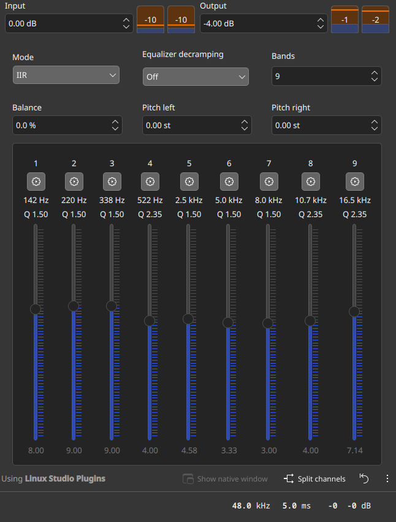

# HP 14s-fq2003au EasyEffects Audio Preset 🎧🔊

[](https://opensource.org/licenses/MIT)
[](https://github.com/wwmm/easyeffects)
[](https://pipewire.org/)
[]()

A finely-tuned, anti-clipping **EasyEffects** audio preset specifically tailored for the **HP 14s Laptop series** (specifically **HP 14s-fq2003au** with AMD Ryzen 5 5625U and Realtek ALC236 audio).

---

## 🧐 The Problem with Default Linux Audio on HP 14s

On Windows, HP laptops rely on proprietary DTS / Realtek APO drivers that heavily process sound in software to compensate for small laptop speakers. When switching to Linux (Fedora, Arch, Ubuntu, etc.), that processing is absent, resulting in:
- Thin, tinny, and hollow sound.
- Violent chassis vibration and buzzing (*plastic rattle*) when low bass notes are played.
- Severe distortion and harsh digital clipping when users try to manually boost the equalizer by +8 dB to +9 dB without proper digital headroom.

---

## ✨ The Solution: `HP-14s-FQ2003AU` Preset

This preset delivers the rich warmth, vocal clarity, and punchy sound signature of custom curves while **eliminating distortion, rattling, and clipping**.



### 🛠️ Acoustic Calibration Breakdown:
1. **75 Hz Sub-Bass Cut (High-Pass Filter):**
   - Tiny 2W laptop speaker diaphragms physically cannot produce frequencies below 75 Hz. Cutting them removes unnecessary cone excursion, eliminating laptop body rattle and distortion.
2. **9-Band Precision Equalizer:**
   - **142 Hz (+8.00 dB, Q 1.50):** Rich lower-end warmth and punch.
   - **220 Hz & 338 Hz (+9.00 dB, Q 1.50):** Solid vocal body and instrument fullness.
   - **522 Hz (+4.00 dB, Q 2.35):** Lower midrange clarity.
   - **2.5 kHz (+4.58 dB, Q 1.50):** Vocal presence and articulation.
   - **5.0 kHz & 8.0 kHz (+3.33 dB / +3.00 dB):** Treble detail and crispness.
   - **10.7 kHz & 16.5 kHz (+4.00 dB / +7.14 dB, Q 2.35):** High-frequency "air" and shimmer.
3. **Calibrated Digital Headroom (-7.5 dB):**
   - High boost (+9 dB) without headroom exceeds 0 dBFS and causes terrible digital clipping. This preset attenuates gain by `-7.5 dB` (`-1.5 dB` input gain + `-6.0 dB` output gain), keeping the exact frequency curve intact with **zero clipping**.
4. **Transparent Brickwall Limiter:**
   - Standby peak limiter (`-0.5 dB` threshold, `15 ms` smooth release) ensures sudden audio spikes never clip or damage your speakers, even at 100% volume.
5. **No Dynamic Squashing:**
   - Aggressive compressors and auto-gain modules are bypassed, preserving the punchy, open dynamic range of your music and media.

---

## 🚀 Quick Installation

### Option 1: One-Line Installer (Recommended)

Open your terminal and run:

```bash
git clone https://github.com/candraalief/hp-14s-fq2003au-easyeffects.git
cd hp-14s-fq2003au-easyeffects
./install.sh
```

The script will automatically copy the preset to your EasyEffects directory and activate it.

### Option 2: Manual Installation

1. Copy `HP-14s-FQ2003AU.json` to your EasyEffects output presets directory:
   ```bash
   mkdir -p ~/.local/share/easyeffects/output
   cp HP-14s-FQ2003AU.json ~/.local/share/easyeffects/output/
   ```
2. Open **EasyEffects**.
3. Go to **Presets** (top-left or bottom icon depending on theme) $\rightarrow$ **Output**.
4. Select **`HP-14s-FQ2003AU`** and click **Load**.

---

## 🧪 Testing Your Audio

We included an automated frequency test suite to verify the tuning:

```bash
./audio-test.sh
```

This runs:
- Sweep tone (100 Hz $\rightarrow$ 15,000 Hz)
- 142 Hz bass resonance test
- 220 Hz & 338 Hz low-mid stress test (anti-clipping verification)
- 1000 Hz baseline reference
- High treble harshness check (10.7 kHz & 16.5 kHz)
- Pink noise tonal balance
- Left/Right stereo channel test

---

## ⚙️ Best Practices & System Configuration

To prevent audio routing issues with PipeWire and external monitors:

1. **Keep Physical Speaker as Default Sink:**
   Never set the virtual `easyeffects_sink` as your system's default device. Your physical laptop speaker (`Ryzen HD Audio Controller Speaker`) should always be the default sink. EasyEffects will automatically hook into application streams.
   ```bash
   pactl set-default-sink alsa_output.pci-0000_03_00.6.HiFi__Speaker__sink
   ```
2. **HDMI Display Audio:**
   If you connect an external HDMI monitor without speakers, disable the HDMI audio profile in System Settings $\rightarrow$ Audio (or set it to `Off`) so it doesn't hijack audio output.

---

## 💻 Tested Hardware Specifications

- **Model:** HP Laptop 14s-fq2xxx / HP 14s-fq2003au
- **CPU:** AMD Ryzen 5 5625U with Radeon Graphics
- **Audio Codec:** Realtek ALC236
- **OS:** Fedora Linux / Arch Linux / Ubuntu (Kernel 6.x+)
- **Audio Server:** PipeWire 1.x + WirePlumber 0.5+

---

## 📄 License

This project is licensed under the MIT License - see the [LICENSE](LICENSE) file for details.

Developed with ❤️ by **[Candra AAP](https://github.com/candraalief)**.
